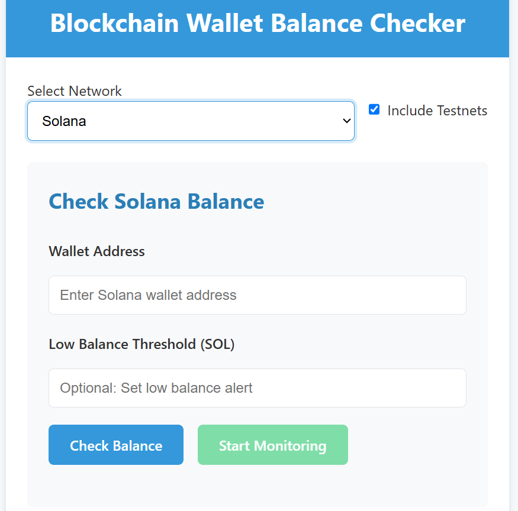

# Blockchain Wallet Balance Checker

A React-based application for monitoring wallet balances across multiple blockchain networks including Ethereum, Polygon, BSC, Avalanche, Base, and Solana. The application supports both mainnet and testnet environments with real-time balance monitoring.



## Features

- **Multi-chain Support**: Monitor wallets on 6 EVM-compatible mainnets (Ethereum, Polygon, BSC, Avalanche, Base) and Solana
- **Testnet Support**: Includes Goerli, Sepolia, Mumbai, BSC Testnet, Avalanche Fuji, Base Sepolia, and Solana Testnet
- **Real-time Balance Monitoring**: Automatically check balances at 30-second intervals
- **Balance Change Notifications**: Visual alerts when balance changes are detected
- **Low Balance Alerts**: Set custom thresholds for low balance warnings
- **Blockchain Explorer Integration**: Direct links to blockchain explorers for each address

## Installation

1. Clone the repository:
   ```bash
   git clone https://github.com/kapildev5262/blockchain-wallet-checker
   cd blockchain-wallet-checker
   ```

2. Install dependencies:
   ```bash
   npm install
   ```

3. Create a `.env` file based on `.env.example` and add your API keys:
   ```
   REACT_APP_ALCHEMY_ETH_KEY=your-alchemy-key
   REACT_APP_ALCHEMY_POLYGON_KEY=your-alchemy-key
   REACT_APP_ALCHEMY_SOLANA_KEY=your-alchemy-key
   ```

4. Start the development server:
   ```bash
   npm run dev
   ```

## Usage

1. Select a blockchain network from the dropdown menu
2. Enter a wallet address to check
3. (Optional) Set a low balance threshold for notifications
4. Click "Check Balance" for a one-time check or "Start Monitoring" for continuous monitoring
5. View balance information and click "View on Explorer" to see the address on the blockchain explorer

## API Keys

This project uses RPC endpoints that may require API keys (especially Alchemy endpoints). For testing, you can use free tiers from:

- [Alchemy](https://www.alchemy.com/)
- [Infura](https://infura.io/)

⚠️ **Important**: Never commit your API keys to GitHub. Use environment variables as shown in the installation section.

## Technologies Used

- React
- JavaScript
- ethers.js
- @solana/web3.js
- Alchemy API

## Future Enhancements

- Transaction history view
- Multiple wallet monitoring
- Push notifications
- Data export functionality

## License

This project is licensed under the MIT License - see the [LICENSE](LICENSE) file for details.
